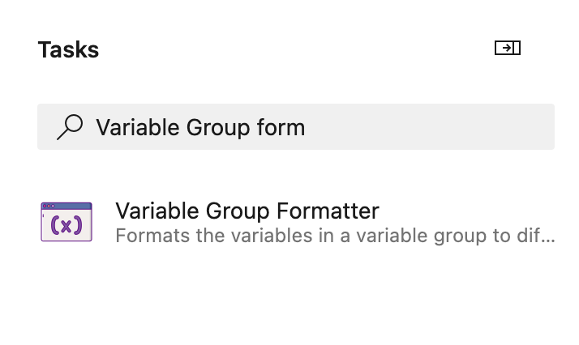
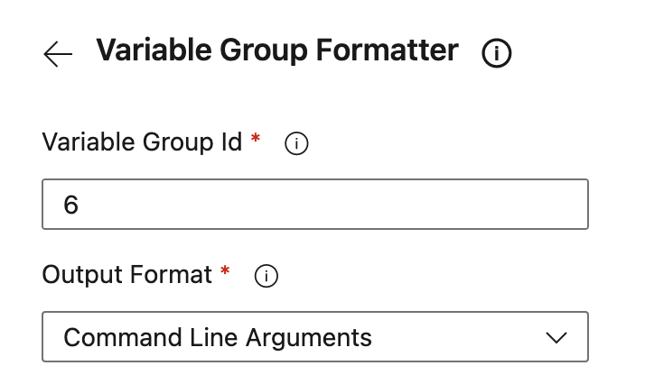

# Variable Group Formatter

This extension enables you to format [variable groups](https://docs.microsoft.com/en-us/azure/devops/pipelines/library/variable-groups?view=azure-devops&tabs=yaml) in your Azure Pipelines. 

## Getting Started

After installing the extension you will find the Task available in Release and Build Pipelines. 



Then you can set the parameters:




### Paramaters

The following parameters are supported in the task:

|Parameter label|Parameter name (for YAML)|Description|
|--|--|--|
| Variable Group ID | `variableGroupID` | Variable Group ID. You can get this value from Azure Devops in the url when you are in a Group Variable or using azure cli  |
| Output Format | `outputFormat` | The output format for the variables in the Variable Group ID. Accepted values are: `Command Line Arguments` and `JSON` |

### Output

The result of the task is expected in an output variable: `formattedVariables`. See the examples section for more information.

### Formats

If you have a Variable Group with the following values

 |Variable Name|Variable Value|
|--|--|
|Variable1| Value 1|
|Variable2| Value 2|


Based on the `Output Format` selected you will get the following output:
 
 |Output Format|Expected Result|
|--|--|
|`Command Line Arguments`| -Variable1 "Value 1" -Variable2 "Value 2"|
|`JSON`|[ {name:"Variable1",value:"Value 1"}, {name:"Variable2",value:"Value 2"} ]|


## Examples


### Override some ARM templates based on a library

In this example, using Output Format as `Command Line Arguments` we are able to replace dynamically ARM template parameters using all the values from a Variable Group

```yaml
steps:
- task: VariableGroupFormatter@0
  name: variableGroup
  displayName: "Format variables"
  inputs:
    variableGroupID: '6'
    outputFormat: 'Command Line Arguments'

- task: AzureResourceManagerTemplateDeployment@3
  inputs:
    deploymentScope: 'Resource Group'
    azureResourceManagerConnection: '$(MyConnection)'
    subscriptionId: '$(MySubscription)'
    action: 'Create Or Update Resource Group'
    resourceGroupName: '$(ResourceGroup)'
    location: 'South Central US'
    templateLocation: 'Linked artifact'
    csmFile: 'Armtemplate.json'
    overrideParameters: '$(variableGroup.formattedVariables)'
    deploymentMode: 'Incremental'
```
